# PROYECTO PÁGINA WEB PARA LECTORES

***Alfonso Jesús Anillo Romero***
***2º DAW***
***IES Rafael Alberti***
***Desarrollo Web en el entorno del cliente***

<image src="img/imgWeb.jpeg" alt="Imagen inicial" width="600px" heigth="100px">

---

## DOCUMENTO DE PROPUESTA

<image src="img/imgDoc.png" alt="Imagen documento" width="300px">

---

### ÍNDICE
* [Descripción](#descripción)
* [Público objetivo](#público-objetivo)
* [Análisis de mercado](#análisis-de-mercado)
* [Funcionalidades clave](#funcionalidades)
* [Tecnologías seleccionadas](#tecnologías-seleccionadas)

---

### Descripción
La página web consiste en crear un espacio para lectores. 
Aquí, los aficionados a la lectura que naveguen por la web podrán realizar varias funciones, como son la compra/venta o compartir opiniones y críticas.

### Público objetivo
Básicamente, cualquier persona interesada puede hacer uso de la web, pero por razones lógicas, el principal objetivo es crear una red de cercanía para aficionados a la lectura.

### Análisis de mercado
Páginas web o aplicaciones relevantes:
* **Lecturalia:** ofrece información sobre libros, autores y premios. Ofrece un espacio donde los usuarios pueden comentar libros y publicar su seguimiento de lectura anual.
* **Goodreads:** sitio web con una amplia biblioteca de libros. Los usuarios publican sus libros favoritos y la web les hace recomendaciones en base a sus gustos.
* **OpenLibrary:** organización sin ánimo de lucro, con una biblioteca muy amplia centrada en libros digitales, los cuales los usuarios pueden pedir prestados.
* **thegreatestbooks:** ofrece listas de los libros mejor valorados, donde las funcionalidades de los usuarios son agregar listas de libros leídos, en proceso de lectura y marcados para su posterior lectura.

Las características comunes de mi web con las más destacadas en el mercado, son la biblioteca de libros, la división en géneros para facilitar la búsqueda y el registro de usuarios para optar por las funcionalidades de la web, siendo una funcionalidad común el poder realizar comentarios.

Donde mi página web va a intentar ser diferenciadora es a la hora de permitir tanto la compra/venta como el alquiler de libros. 
La posibilidad de organizar encuentros en la comunidad también es novedosa.

**Referencias:**
**- 12 sitios de interés para los amantes de la lectura:** https://hipertextual.com/2015/04/sitios-web-para-lectores
**- OpenLibrary:** https://es.wikipedia.org/wiki/Open_Library

### Funcionalidades
1. Ofrecer un catálogo de libros para comprar/vender o alquilar.
2. Permitir a los usuarios compartir opiniones sobre sus libros favoritos.
3. Promover quedadas de aficionados para hacer encuentros de lectura o incluso encuentros de ocio.

### Tecnologías seleccionadas
El proyecto está dividido en dos partes principales:
- **Entorno-servidor:** se desarrollará con *PHP*, utilizando el framework `Laravel`. 
Los motivos de esta elección son el auge de Laravel actualmente como framework (siempre conviene utilizar tecnologías con impacto en la actualidad) y la buena gestión práctica de PHP a la hora de trabajar con bases de datos.
- **Entorno-cliente:** se elaborará con el framework `React`, el cual trabaja con los lenguajes *HTML*, *CSS* y *Javascript*. Vuelvo a incidir en la importancia de utilizar tecnologías que no estén obsoletas y tengan relevancia en la actualidad. Los frameworks que trabajan con Javascript están en auge, y React es uno de los más importantes hoy en día.

---

## INFORME TÉCNICO

<image src="img/imgInfo.jpg" alt="Imagen informe" width="300px">

---

### ÍNDICE
* [Análisis de modelos de ejecución cliente/servidor](#análisis-de-modelos-de-ejecución-clienteservidor)
* [Análisis de los lenguajes de programación](#análisis-de-los-lenguajes-de-programación)
* [Mecanismos de ejecución en navegadores](#mecanismos-de-ejecución-en-navegadores)
* [Integración de los lenguajes de marcas](#integración-de-los-lenguajes-de-marcas)
* [Herramientas de programación para clientes](#herramientas-de-programación-para-clientes)
* [Análisis de mercado 2](#análisis-de-mercado-2)

---

### Análisis de modelos de ejecución cliente/servidor
Cada vez que una persona decide iniciar una búsqueda en un navegador web, e introduce, o bien una URL, o bien el nombre de la búsqueda, cuando se pulsa un enlace, se muestra la web seleccionada. 
Este proceso, dentro del programa, consiste en que la URL de la web se traduce internamente en una dirección IP, la cual proporciona un intercambio de datos entre equipos, dotándolo de seguridad y fiabilidad.

Dentro de esta comunicación, es donde hay que diferenciar entre cliente y servidor.
El cliente es el ordenador utilizado por el usuario que navega por internet, mientras que el servidor es el hardware que proporciona servicios al cliente. El cliente manda la solicitud y el servidor la recibe y le devuelve información solicitada. 

Ejemplo: un cliente pulsa el enlace a una lista de ordenadores para consultar información. Cuando el navegador abre la página solicitada, muestra la lista de ordenadores, la cual está ubicada en la base de datos del sistema.

**Referencias:**
**- Modelo TCP/IP:** https://es.wikipedia.org/wiki/Modelo_TCP/IP
**- Diferencia cliente - servidor:** https://miracomosehace.com/diferencia-cliente-servidor-tipos-arquitecturas/

### Análisis de los lenguajes de programación

#### Entorno cliente

**JavaScript:** actualmente es uno de los lenguajes más populares del mundo. Es un lenguaje interpretado, orientado a objetos, débilmente tipado y dinámico. Las características claves en su uso en el lado del cliente son su rapidez, su escaso uso de recursos y su ejecución dentro del dispositivo.

Tiene compatibilidad con HTML y más lenguajes.

Existen multitud de frameworks que trabajan con JavaScript, como pueden ser React, Angular y Vue.

Puede presentar cierta falta de compatibilidad entre navegadores, no tiene buen nivel de seguridad, puede tener bajo rendimiento en aplicaciones complejas y no es el más adecuado para dispositivos móviles. 

En la gran mayoría de las empresas, existe un equipo que trabaja con este lenguaje. Ejemplos: Netflix, Uber y Antresmedia.

**CSS:** lenguaje frontend creado con el propósito de ejercer un control sobre el diseño web, definiendo la apariencia y disposición de los distintos elementos de un documento.

Se interpreta de la misma forma en todos los navegadores.

Su curva de aprendizaje es alta y puede tener problemas de carga si se usa excesivamente animaciones y demás efectos.

**HTML:** lenguaje de marcado para la creación de páginas web. Centrado en el contenido "fijo" de la web, es decir, se crea lo que va a permanener inmóvil en la página (imágenes, textos, títulos, encabezados...). De la parte dinámica se encargaría JavaScript. 

Se puede incrustar prácticamente en cualquier lenguaje de programación.

Es uno de los lenguajes más sencillos de aprender.

Tiene una interactividad muy limitada, también es limitado en cuanto a diseño y puede ser dependiente de otros lenguajes. 

**Swift:** lenguaje de frontend moderno creado para el desarrollo de aplicaciones para la gama de productos de Apple, enfocado en los sistemas iOS y macOS.

Sencillo de aprender y destaca por la gestión de errores.

Es dependiente de Apple, por tanto, su compatibilidad es muy limitada.

Sus frameworks más populares son Cocoa y Cocoa Touch.

**TypeScript:** lenguaje de código abierto, por tanto, de acceso y distribución libre. Creado con el propósito de ofrecer lo mejor de Javascript y resolver sus carencias. Es de alto nivel y orientado a objetos.
En teoría, al ser una versión moderna de JavaScript, posee una serie de ventajas a la hora de integrarse con frameworks, como Angular o Ember, sin embargo, su curva de aprendizaje es más dificultosa.

| JavaScript |  CSS |  HTML  |  Swift  |  TypeScript  |
|-----|-----|-----|-----|-----|
|  | 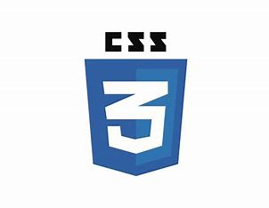 |  | 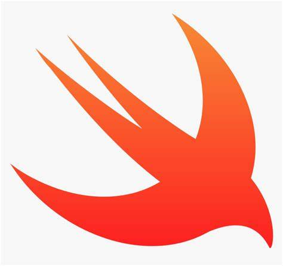 | 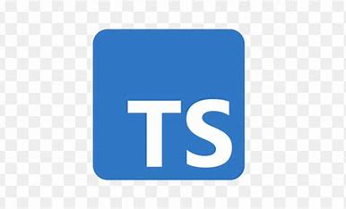 |

**Referencias:**
**- Principales lenguajes en el entorno del cliente:** https://blog.back4app.com/es/los-10-principales-lenguajes-de-desarrollo-del-lado-del-cliente/#:~:text=Los%2010%20principales%20lenguajes%20de%20desarrollo%20del%20lado,archivos%20de%20proyecto.%20...%208%208.%20Swift%20
**- JavaScript:** https://es.wikipedia.org/wiki/JavaScript
**- Ventajas y desventajas de JavaScript:** https://www.w3.org/WAI/standards-guidelines/es
**- Swift:** https://es.wikipedia.org/wiki/Swift_(lenguaje_de_programaci%C3%B3n)
**- TypeScript:** https://www.unir.net/ingenieria/revista/que-es-typescript/#:~:text=TypeScript%20es%20un%20lenguaje%20de%20programaci%C3%B3n%20de%20c%C3%B3digo,proyectos%20y%20que%20permite%20trabajar%20de%20manera%20estructurada.
**- TypeScript frente a JavaScript:** https://www.campusmvp.es/recursos/post/typescript-contra-javascript-cual-deberias-utilizar.aspx

#### Entorno servidor

**C#:** lenguaje desarrollado y comercializado por Microsoft. Estático y orientado a objetos.
Dentro de sus frameworks, en el desarrollo para el entorno del servidor, destaca `ASP.NET`, siendo su principal característica la posibilidad de establecer una división entre la capa de diseño y la de código. 

Su tiempo de compilación es excesivo y tiene dependencia de la plataforma .NET.

**PERL:** lenguaje multiplataforma, orientado a objetos y  dinámico. Toma muchas características de C, por lo que puede entenderse como una versión de C más moderna.

No tiene buen manejo en el control de excepciones posee una de las peores legibilidades de código dentro del mundo de la programación.

**Java:** lenguaje multiplataforma, orientado a objetos. Es tanto compilado como interpretado. Posee JVM, que es su propia máquina virtual para ejecutar el código.

Con bastante peso en el mundo de la programación desde hace años. Su principal framework es `Sring Boot`.

Presenta la ventaja de la alta seguridad que ofrece y de administrar automáticamente la memoria, a través de JVM. Pero también tiene dependencia de JVM, la cual le proporciona también un consumo excesivo de memoria y ralentización a la hora de ejecutar.

Su interfaz gráfica (GUI) está desfasada.

**PHP:** es el lenguaje más utilizado actualmente en el entorno servidor. Es de código abierto, es decir, se puede programar cualquier proyecto con PHP y puede ser comercializado sin problemas.

Destaca la facilidad para establecer conexiones con bases de datos, especialmente con las relacionales.

La gran mayoría de las empresas, tienen departamentos trabajando con PHP. Incluso en las PYMES, es el más utilizado a la hora de desarrollar.

Es dependiente de un servidor para su ejecución y tiene problemas de seguridad.

**Python:** lenguaje interpretado, dinámico y multiplataforma, con licencia de código abierto. Sencillo de entender y programar.

Consume mucha memoria, no es veloz y no es eficaz en móviles.

Sus frameworks más famosos son Django y Flask.

**NodeJS:** adaptación de JavaScript al backend, permitiendo su ejecución en servidores.

Tiene una curva de aprendizaje muy complicada para desarrolladores que no conocen JavaScript.

| C# | Perl |  Java  |  PHP  |  Python  | NodeJS |
|-----|-----|-----|-----|-----|-----|
| 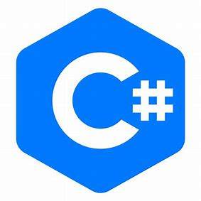 | 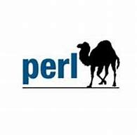 |  |  |  | 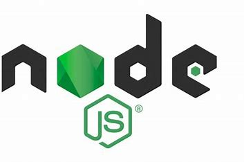 |

**Referencias:**
**- Principales lenguajes en el entorno del servidor:** https://axarnet.es/blog/lenguajes-del-lado-del-servidor#:~:text=Los%20lenguajes%20del%20lado%20del%20servidor%20m%C3%A1s%20utilizados,en%20la%20actualidad%20son%3A%20ASP%2C%20PERL%20y%20PHP.
**- C#:** https://www.mytaskpanel.com/introduccion-a-csharp/
**- Perl:** https://www.arimetrics.com/glosario-digital/perl
**- PHP:** https://rockcontent.com/es/blog/php/
**- Python:** https://es.wikipedia.org/wiki/Python
**- Pros y contras de Python:** https://www.liderlogo.es/diseno-web/python-pros-y-contras/

### Mecanismos de ejecución en navegadores

#### Entorno cliente
Los lenguajes encargados del desarrollo en el entorno del cliente, tienen la particularidad de que se ejecutan en el propio navegador.
Características que presentan la ejecución en navegadores son, aparte de la ejecución de código: 
- Manipulación del DOM
- Gestión de eventos
- Comunicación asíncrona con servidores

La compatibilidad con navegadores sigue las normas y los estándares establecidos por W3C (World Wide Web Consortium).

**Resumen de las Normas y estándares de W3C:** https://www.w3.org/WAI/standards-guidelines/es

Existen una amplia gama de navegadores (Google Chrome, Mozilla Firefox, Safari...). Para facilitar la compatibilidad entre todos ellos, con especial cuidado a la hora de adaptar el contenido entre navegadores modernos y antiguos, se pueden usar diferentes transpiladores, siendo los más usados:
- Polyfills
- Babel

#### Entorno servidor
Normalmente, los lenguajes de programación utilizados en el entorno del servidor tienen sus propias máquinas para ejecutar el código, por ejemplo, Java posee JVM. Pero, cuando se desea hacer pública una web, se debe hacer uso de los servidores encargados de ello.

Hay dos tipos de servidores:
- **Web:** Son plataformas que almacena el contenido que luego entregan a los usuarios cuando navegan. Ejemplos: Apache, Nginx y Microsoft IIS.
- **Nube:** Se encargan de lo mismo que los servidores web, con la diferencia de que son gestionados por proveedores externos. Ejemplos: AWS, Google Cloud y Azure.

Una ventaja que proporcionan los lenguajes en este tipo de desarrollo, es que trabajan con el acceso a bases de datos, función que los lenguajes del entorno del cliente no pueden realizar.

**Referencias:**
**- Desarrollo web en el entorno cliente:** https://aapri.es/wp/?page_id=534
**- Características de los navegadores:** https://iescomercio.com/informatica/download/PD/FP/DAW/23-24_DAW2_DWEC.pdf
**- Desarrollo web en el entorno servidor:** https://iescomercio.com/informatica/download/PD/FP/DAW/23-24_DAW2_DWES.pdf
**- Apuntes asignatura DWES IES Rafael Alberti**
**- Qué es un servidor web:** https://blog.hubspot.es/website/que-es-servidor-web
**- Qué es un en la nube:** https://aws.amazon.com/es/what-is/cloud-server/

### Integración de los lenguajes de marcas
Los lenguajes de marcas son los que se utilizan para estructurar y dar formato a páginas webs. Utilizan etiquetas para ello. 
Los más utilizados a día de hoy son *HTML* y *XML*.

Junto a los lenguajes de marcas, se integran otra serie de lenguajes para que las páginas web tengan diferentes funcionalidades, tanto a nivel de presentación, como de interacción del usuario.

Los lenguajes más comunes en la integración con los lenguajes de marcas son:

**Integración con HTML:**

- **CSS:** encargado del diseño y de mejorar la apariencia de la web. Encargado de aplicar diferentes estilos, como pueden ser el tamaño de las fuentes, los colores, los bordes y rellenos e incluso puede dotar de efectos de animación. Un ejemplo de aplicación de CSS sería un formulario que tuviese un botón de enviar y otro de cancelar. El botón de enviar es de color verde y el de cancelar es rojo. Ambos cuando tienen el cursor encima, incrementan su tamaño. Ésto se consigue con CSS.

- **JavaScript:** ya definido en un punto anterior, en la integración con HTML se encarga de realizar las labores de interacción del usuario. Por ejemplo, en una web que tenga información sobre distintos países, para acceder a la información de cada país, se debe pulsar sobre el icono de su bandera. Una vez pulsado, se abre el documento encargado de mostrar la información del país seleccionado. Del correcto funcionamiento de este proceso se encarga JavaScript.

- **PHP:** se integra con varios propósitos, como son generar dinamismo a los usuarios (envío de mensajes, recordatorios, ofrecer contenido personalizado...), interactuar con bases de datos, manejo de sesiones de cookies, integración con APIs para agregar servicios externos o gestionar la autenticación y autorización de usuarios.

**Integración con XML:**

- **Java, .NET y Node.js:** los lenguajes y frameworks más populares los introduzco en el mismo punto porque todos se integran con XML por los mismos motivos, que son la gestión de datos (almacenamiento e intercambio). 
Un caso bastante común de utilización de XML es un proyecto que trabaje con bases de datos no relacionales. Por ejemplo, un proyecto realizado con Node.js y con MongoDB como gestor de base de datos, puede utilizar XML para el almacenamiento de la base de datos. A través de *Node.js*, se programan métodos que gestionen la información.
Java también hace lo mismo, a través de la biblioteca *JAXB*.

**Referencias:**
**- Integrar PHP en HTML:** https://aprendizdeprogramadorweb.com/php-html/
**- XML y Java:** https://codegym.cc/es/groups/posts/es.212.xml-en-java

### Herramientas de programación para clientes

- **React:** biblioteca de JavaScript para construir interfaces de usuario. Popular por su flexibilidad, fue creada por los desarrolladores de Facebook para desarrollar aplicaciones de manera desacoplada del backend.
Sus principales ventajas son la utilización de un virtual DOM que mejora el rendimiento de las operaciones de manipulación del DOM, y JSX, que es una extensión que permite escribir HTML dentro del código JavaScript.

- **Vue:** framework de JavaScript para crear interfaces de usuario. Utiliza también HTML y CSS. Tiene una curva de aprendizaje más sencilla que otros frameworks de front, ya que centra su atención en HTML, y posee la ventaja de que se pueden adaptar proyectos elaborados con otras tecnologías a Vue. 

- **Angular:** framework de desarrollo web basado en TypeScript, aunque también se puede codificar mediante JavaScript. Mantenido por Google, es ideal para desarrollar aplicaciones complejas. 
Ventajas: es de alta calidad, tiene enlace bidireccional de datos y es multiplataforma. 

- **Sass:** procesador de CSS que ofrece utilidades que no se encuentran en CSS, basadas en facilitar su escritura y mantenimiento. También procura que el código sea más entendible por el navegador.
Entre las utilidades que añaden, se pueden encontrar el uso de variables, establecer herencias entre propiedades o la anidación de selectores.

- **Bootstrap:** framework desarrollado por Twitter que facilita la creación de sitios webs y los adapta a entornos móviles, enfocado en ofrecer una colección de sintaxis para el desarrollo de plantillas. 
Tiene una alta compatibilidad con navegadores, puede dimensionar automáticamente las imágenes en función del tipo de navegador y es fácil de usar.
Presenta el problema de ralentizar los tiempos de carga, ya que sus archivos son de gran tamaño.

- **Git:** es el sistema de control de versiones más popular. Permite desplegar el código de una aplicación, hacer un seguimiento de los cambios y las novedades en el proyecto y permite colaboraciones con otras personas.

- **VSCode:** Visual Studio Code es el IDE más popular actualmente y con mucha diferencia a la hora de realizar proyectos de front. Desarrollado por Microsoft. 
Posee las ventajas de ser ligero, tiene muchas extensiones que ayudan a realizar los proyectos, soporta muchos lenguajes de programación y tiene la particularidad de que proporciona un simulador de página web donde va mostrando los cambios conforme el desarrollador codifica.

- **Postman:** herramienta para el desarrollo de APIs, que permite probar, documentar y compartir APIs con facilidad. 

| React | Vue |  Angular  |  Saas  |  Bootstrap  | Git | VSCode | Postman |
|-----|-----|-----|-----|-----|-----|-----|-----|
|  |  | 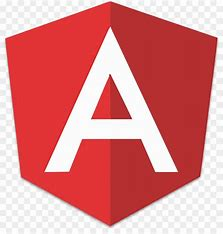 |  | 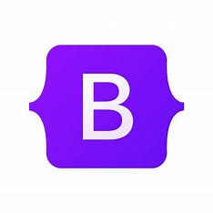 | 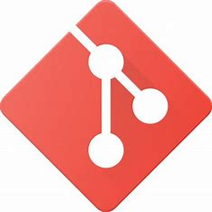 | 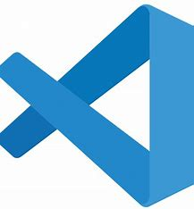 |  | 

**Referencias:**
**- Herramientas más populares para el desarrollo web:** https://tuatara.co/blog/software/herramientas-desarrollo-web/
**- React:** https://reactiveprogramming.io/blog/es/react/que-es-react
**- Vue:** https://lenguajejs.com/vuejs/introduccion/que-es-vue/
**- Angular:** https://blog.hubspot.es/website/que-es-angular
**- Sass:** https://desarrolloweb.com/articulos/que-es-sass-usar-sass.html
**- Bootstrap:** https://www.hostinger.mx/tutoriales/que-es-bootstrap

### Análisis de mercado 2
La mayoría de las empresas trabajan con tecnologías de moda, incluso las grandes empresas integran todo tipo de tecnologías, dividiéndose en diferentes departamentos.

En las empresas pequeñas, lo más común es utilizar Laravel (framework de PHP) para el desarrollo en el entorno del servidor.

Ejemplos de empresas famosas según el lenguaje que utilizan:

| Lenguaje | Logo | Empresas |
|--------|----|-------------|
| `JavaScript` |  | Google y Facebook |
| `Java` |  | Amazon y Linkedin |
| `PHP` |  | Facebook y Wikipedia |
| `Python` |  | NASA y Dropbox |
| `C++` | 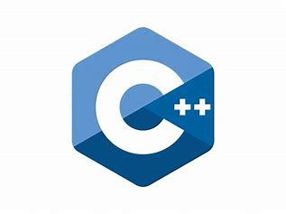 |  Adobe |
| `Swift` |  | Apple |

Añadir que para la gestión de las bases de datos, se suele utilziar *SQL*.

Archivo subido al repositorio de Github:

